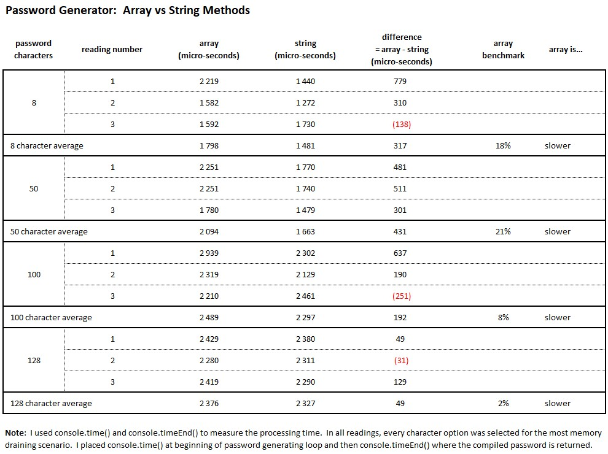

# USYD-FSF Week 3 Project
## JavaScript: Password Generator

### Table of Contents  
  
   1. [Project Description](#1-description)
   2. [Application Features](#2-features)
   3. [Installation](#3-installation)
   4. [Usage](#4-usage)
   5. [Credits](#5-credits)
   6. [License](#6-license)
   7. [Repository Status](#7-github-repo-status)
   8. [Contribute](#8-how-to-contribute)
   9. [Tests](#9-tests)
   10. [Checklist](#10-checklist)

---
### 1. Description  
**What is this project?**  
* Modifying starter code to create a password generator powered by JavaScript code written by me.  The user interface is clean and polished is as per the code provided before I added the JavaScript. 

**Why this project?**  
* Create an application for employees to generate random passwords based on criteria they've selected.

**What problem does this project solve?**  
* Provides a web based password generator that can improve user's security, subject to the password criteria they select such as including special characters in the password to be generated.

**Lessons learnt?**  
* I purchased the set of books called The JavaScript language by [Ilya Kantor](https://javascript.info/first-steps) around the same time I commenced this assignment.  There are some good sections on code style.  I've tried to adopt all of the cdoing styles as per this diagram from the book: 

* Als explored performance difference between different coding approaches - string or array.  Unexpectedy I found that for this application, passing a string into the random method is slightly faster than working with an array, array was approximately 11% slower.  Extract of the performance results I got:  

---
### 2. Features  
Client requested features as implemented:  
- web based password generator;
- a password length of between 8 and 128 characters inclusive to be inputted by the user; and
- gives me the option to include any combination of: lower case letters; upper case letters; numbers; or special characters in the password.

#### The webpage

 

---
### 3. Installation  
You can download the source code from [my Github repository](https://github.com/Mark33Mark/password-generator)  and open the index.html file to review the website inside your selected web browser.  
Alternatively, the webpage has also been hosted via [URL: trust.watsonised.com](https://trust.watsonised.com)

---
### 4. Usage  
The code is available from [my Github repository](https://github.com/Mark33Mark/password-generator) with all assets created for the project.  
Once you've downloaded, you can modify the code as you need.

---
### 5. Credits  
I've referenced [W3 Schools website](https://www.w3schools.com) where I've used their information.
I also credit [Ilya Kantor](https://javascript.info/first-steps) for writing a book that is very easy to read and learn from.

---
### 6. License  
 The works in this repository are subject to:  

---
### 7. Github repo status  

---
### 8. How to Contribute
 If you would like to contribute, please comply with the Contributor Covenant Code of Conduct:  

---
### 9. Tests  
- Opened on a Samsung Note 10+ and experienced full functionality and responsive behaviour as expected.

---
### 10. Checklist  
 All actions not checked are still to be completed:
  * [x]  When Generate Password selected on website, the user is presented with a series of prompt / confirm windows requesting the user's preferences for the password to be generated.
  * [x]  The user needs to key in a number between 8 and 128, inclusive, for the password length.  For the other criteria questions, the user can choose by clicking ok for yes or cancel for no.
  * [x]  The password criteria available to the user are lower case, upper case, numeric and special characters.
  * [x]  The user's criteria selection is validated confirmin at least one character type has been selected.
  * [x]  When all criteria questions have been answered a password is generated.
  * [x]  The password is written to the page.
  * [x]  Deployed at live URL, [website](https://trust.watsonised.com) 
  * [x]  Application loads with no errors when inspected with Chrome DevTools.
  * [x]  Github repository contains application code [Github location](https://github.com/Mark33Mark/password-generator)
  * [x]  Repository has a unique name; follows best practice for file structure; and naming conventions.
  * [x]  Repsository follows best practices for class/id naming conventions, indentation, quality comments, etc.
  * [x]  Repository contains multiple descriptive commit messages.
  * [x]  Repository contains a README file with description, screenshot and link to deployed application.
---

- [Back to the top](#usyd-fsf-week-3-project)